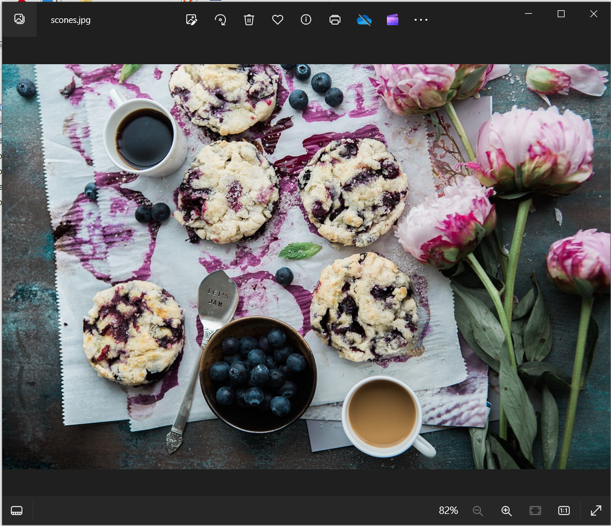

# Gemini Vertex は画像を記述します

## 1. ビジネスロジックフロー

ユーザー

│

│ 1. 質問する

│

▼ アプリケーション

│

│ 2. プロンプトを受け取る

│

│ 3. 画像を受信

│

▼ AI リクエストを準備する

│

│ リクエストを作成する:

│ - プロンプト

│ - 画像

│ - モデル

│

▼ Vertex AI
│

│ 画像を分析する

│

│ プロンプトを理解する

│

│ 回答を生成する

│

▼ アプリケーション

│

│ 応答を受け取る

│

│ テキストを抽出する

│

▼ ユーザー

## 2. クライアントを作成する

```client, err := genai.NewClient(ctx, projectID, location)
```

これは Gemini を呼び出しません。代わりに、クライアントオブジェクトを作成します。


内部的には、おおよそ以下の処理が行われます。

アプリケーション
│

▼
認証情報の読み込み
│

▼
HTTPクライアントの初期化
│

▼
プロジェクトIDの保存
│

▼
リージョンの保存
│

▼
クライアントの返却

## 3. モデルの取得

**go.mod**を作成します。

```model := client.GenerativeModel(modelName)
```

## 4. 画像の準備

```
img := genai.FileData{

MIMEType: "image/jpeg",

FileURI: image,
}
```

## 5. プロンプトの準備

```
genai.Text(prompt)
```

## 6. GenerateContent()

```
res, err := model.GenerateContent(

ctx,

img,

genai.Text(prompt),
)
```

結果が表示されます画像 